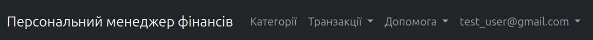
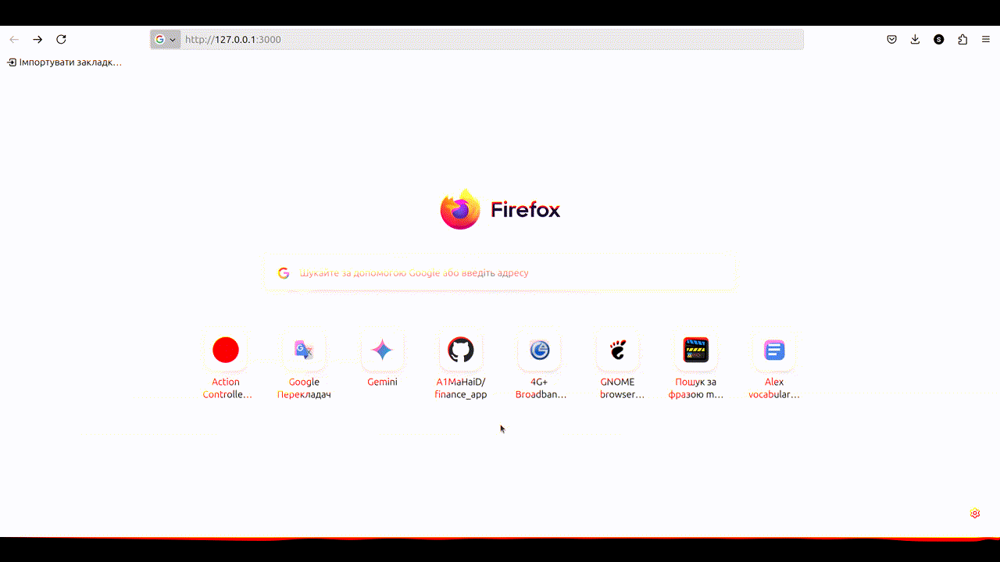
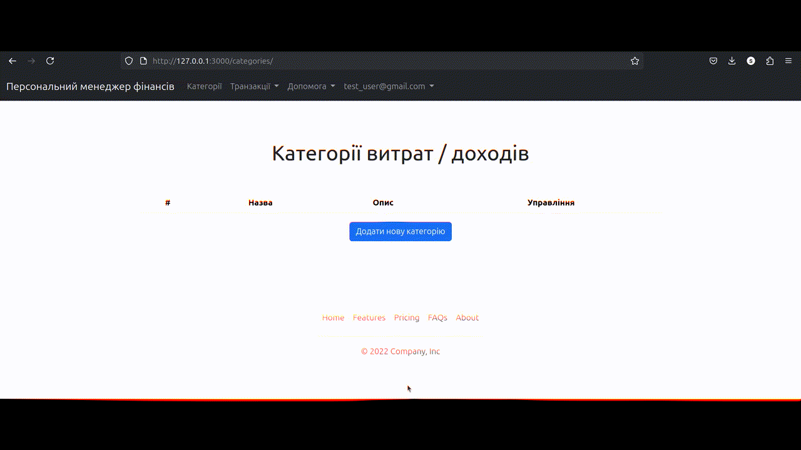
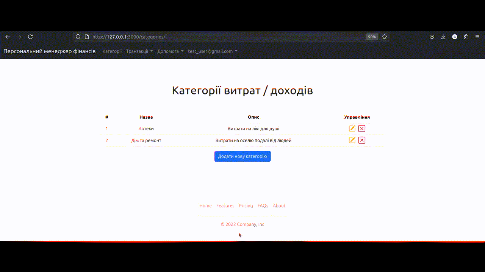

# Finance App



Finance App is a web application that helps you manage your personal finances. With this application, you can create and manage expense/income categories, record financial operations, and generate detailed reports with interactive charts.
**Link to website https://infinite-tundra-76682-60e16c41061d.herokuapp.com**

## Features

- **Category Management:** Create, edit, and delete custom financial categories.
- **Operations Tracking:** Add financial operations with detailed information (amount, date, description, and type).
- **Interactive Reports:** Generate and view reports by category or date ranges with graphical representations.
- **User Authentication:** Secure login and user management using Devise.

## System Requirements

- **Ruby Version:** 3.x
- **Rails Version:** 6.x (or specify your version)
- **Database:** PostgreSQL/MySQL/SQLite (specify, if needed)

## Setup Instructions

1. **Clone the repository:**
   ```bash
   git clone https://github.com/your_username/finance_app.git
   cd finance_app
2. **Install dependencies:**
   ```bash
   bundle install
   yarn install  # if using webpacker or similar
3. **Configure the database:**
    ```bash
    rails db:create
    rails db:migrate
    rails db:seed
4. **Run the test suite:**
    ```bash
    rails test
5. **Start the server:**
    ```bash
   rails server
Open http://localhost:3000 in your browser.

## How to Use
### Authentication
**Sign Up:** Create a new account by providing your email and password.


**Login:** Use your email and password to log in.

**Change Email or Password:** Navigate to the user settings page to update your email or password.
### Categories
**Add Category:** Click on "Add New Category" button on the Categories page.

**Edit Category:** Click the edit icon next to a category.

**Delete Category:** Click the delete icon to remove a category.
### Operations
**Record Operation:** Click "Add Operation" on the Operations page, fill in the form, and save.

**Generate Reports:** Navigate to the Reports section to view interactive charts that summarize your expenses or incomes.

## Contribution
If you would like to contribute to the development of the project, please see the file
[CONTRIBUTING.md](CONTRIBUTING.md).
